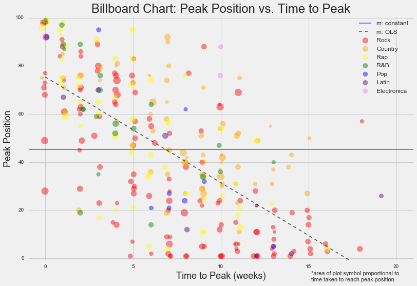
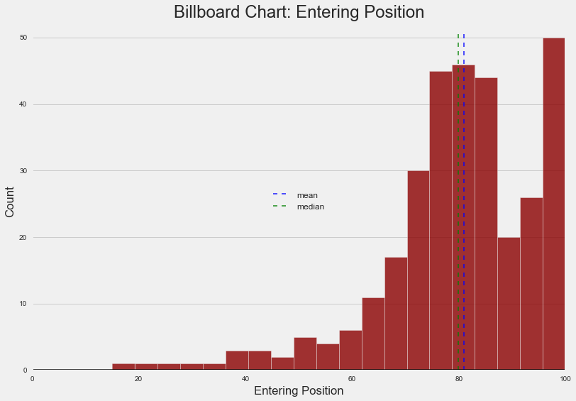
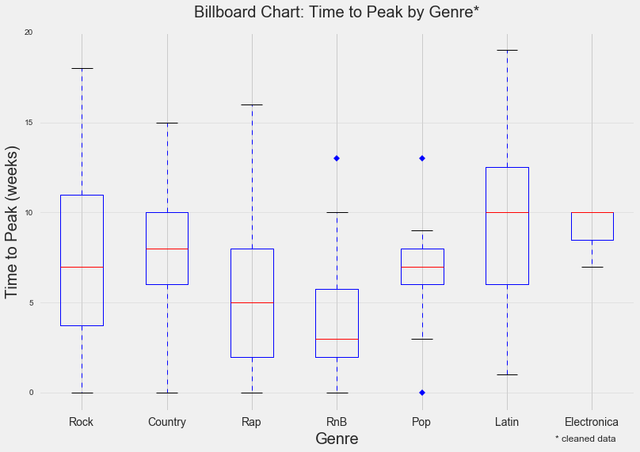

&nbsp;&nbsp;&nbsp;&nbsp;&nbsp;&nbsp;Here I examined data on 317 different songs hitting the Billboard chart in the year 2000.  These variables considered are: song length, chart entry position, peak chart position, and weeks elapsed from entry until peak.  After some cleaning, the box plots below that songs tend to enter lower and then peak (instead of peaking and dropping off the chart, for example).  Peak position is attained, on average, about seven weeks after entry on the chart.

&nbsp;&nbsp;&nbsp;&nbsp;&nbsp;&nbsp;Song length is -- perhaps unsurprisingly (due to human attention span and other factors such as commercial demand for radio airtime) -- pretty normally distributed around four minutes, just at a glance.  We can see this nicely illustrated in the following histogram:

&nbsp;&nbsp;&nbsp;&nbsp;&nbsp;&nbsp;

&nbsp;&nbsp;&nbsp;&nbsp;&nbsp;&nbsp;There appears to be a linear relationship between the amount of time it takes a song to reach peak position on the chart and the position ranking itself, as we can see in the scatterplot at the top of the page.  Using a two-tailed t-test at a 0.05 significance level, we detect a significant relationship between these two variables; the longer a song takes to peak, the higher the peak position tends to be.

Rock 'n' roll!
