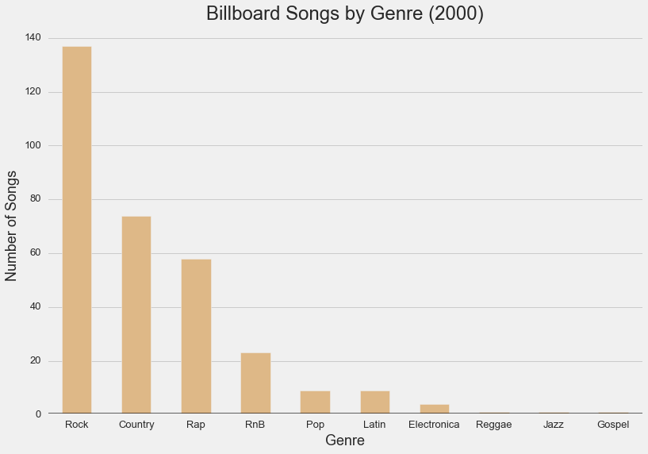
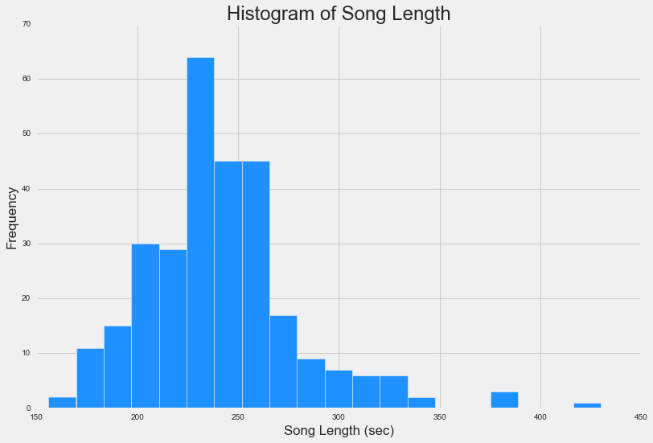
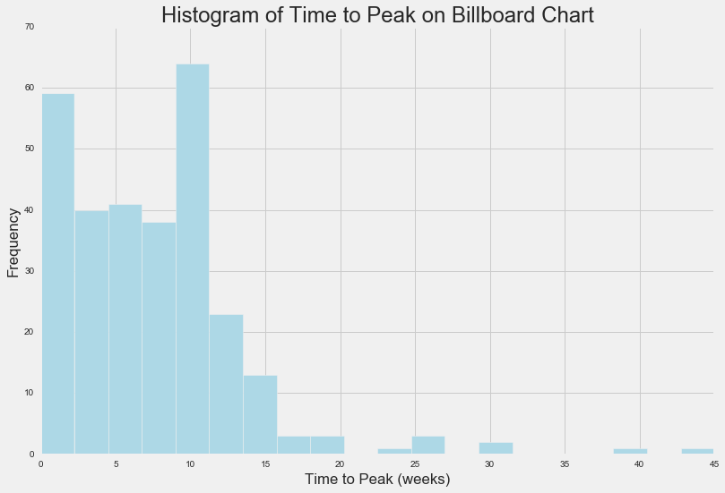
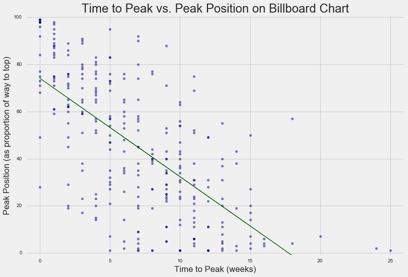

Wouldn't it be great to be able to predict Billboard song behavior??  

Investigating the provided information -- which includes data on 317 different
songs from the year 2000 -- we can study various relationships between
variables.  After some cleaning, we can see from these boxplots that songs tend
to enter lower and then peak. This occurs, on average, after about seven weeks.

Song length is, perhaps unsurprisingly due to human attention span and other
factors, pretty normally distributed around four minutes just at a glance:

Once a song enters the Billboard charts, this histogram shows that it likely
attains its peak position or leaves the chart altogether:

There appears to be a linear relationship between the amount of time it takes
a song to reach peak position on the chart and the position ranking itself, as
we can see in this scatterplot:

But, unfortunately, using a two-tailed t-test at an alpha = 0.05 significance
level, we failed to detect a meaningful relationship between these two
variables.  Better keep looking!
