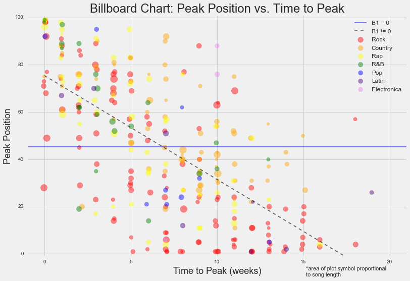
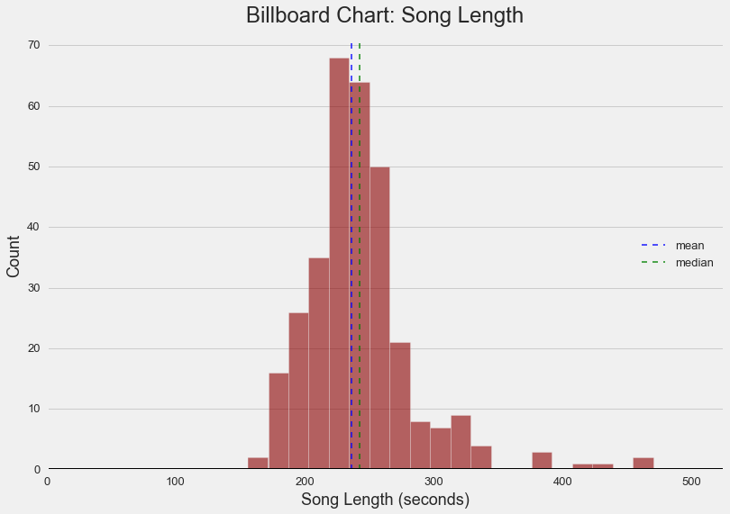
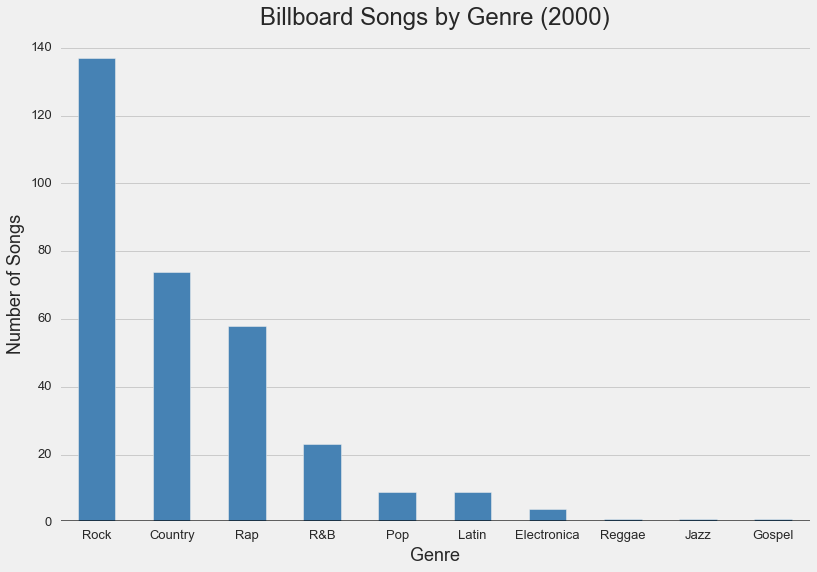

&nbsp;&nbsp;&nbsp;&nbsp;&nbsp;&nbsp;[Here](https://github.com/forzavitale/DSI-projects/tree/master/PROJECTS/Billboard%20Chart), we examine data on 317 different songs hitting the Billboard Hot 100 chart in the year 2000.  The features explored include: song length, chart entry position, peak chart position, and weeks elapsed from entry until peak.  

&nbsp;&nbsp;&nbsp;&nbsp;&nbsp;&nbsp;Song length is -- perhaps unsurprisingly, due to human attention span and other factors such as commercial demand for radio airtime -- fairly normally-distributed with mean somewhere around four minutes.  This is illustrated in the following histogram:

&nbsp;&nbsp;&nbsp;&nbsp;&nbsp;&nbsp;In terms of genre representation in the Billboard Hot 100, Rock, Country, and Rap are clearly the most popular of those included:

&nbsp;&nbsp;&nbsp;&nbsp;&nbsp;&nbsp;Inspecting the scatterplot at the top of the page, there appears to be a linear relationship between the amount of time it takes a song to reach peak position on the chart and the peak position; in fact, we see evidence of this at a 0.05 significance level using an OLS regression (broken line, pictured).

Rock 'n' roll!
