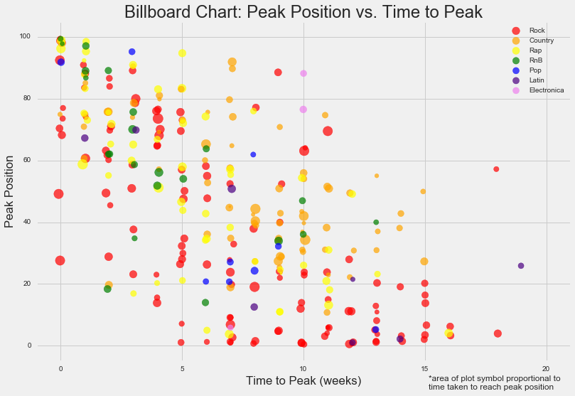
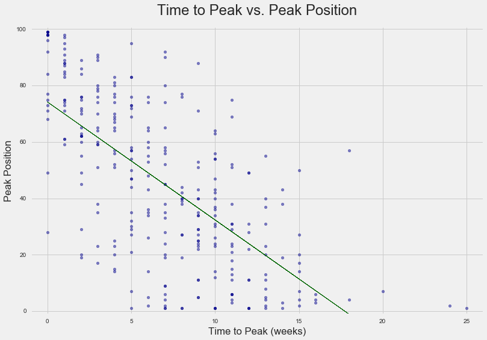

Wouldn't it be great if we could predict Billboard song behavior??  

We investigated the information provided -- which includes data on 317 different
songs hitting the Billboard chart from the year 2000 -- and studied several
relationships between independent variables.  These variables are: song length,
chart entry position, peak chart position, and weeks elapsed from entry until
peak.  After some cleaning, we can see from the box plots here below that songs
tend to enter lower and then peak (instead of peaking and dropping off the
chart, for example).  Peak position is attained, on average, about seven weeks
after entry on the chart.

Song length is -- perhaps unsurprisingly (due to human attention span and other
factors such as commercial demand for radio airtime) -- pretty normally
distributed around four minutes, just at a glance.  We can see this nicely
illustrated in the following histogram:

Once a song enters the Billboard charts, this histogram shows that it likely
attains its peak position or leaves the chart altogether:

There appears to be a linear relationship between the amount of time it takes
a song to reach peak position on the chart and the position ranking itself, as
we can see in this scatterplot:

Using a two-tailed t-test at a 0.05 significance level, we detect a
meaningful relationship between these two variables.  

Rock n roll!
