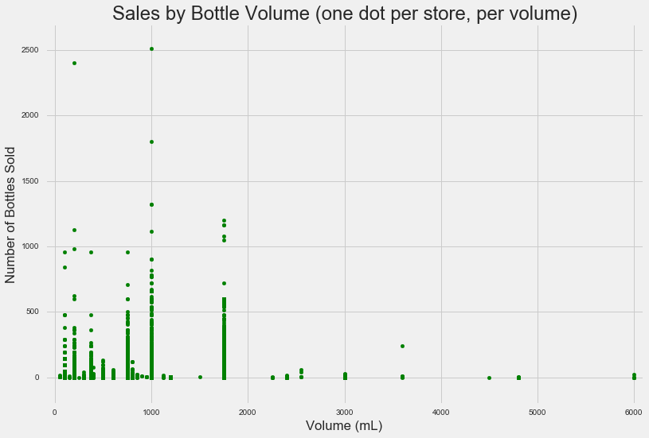
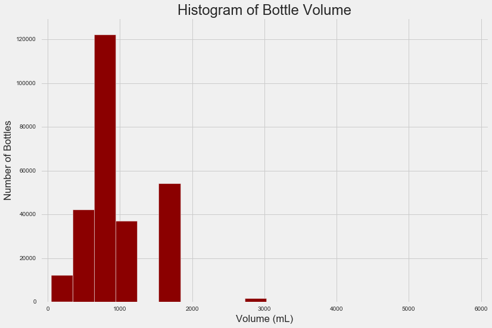
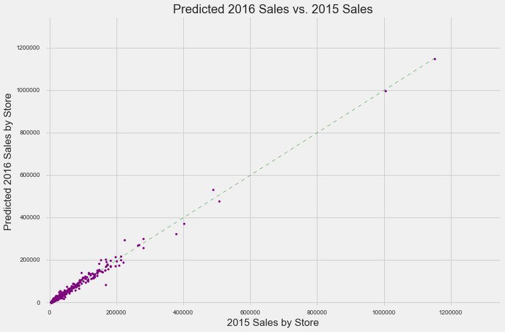

We have analyzed the liquor sales for each store using the data provided. Quarterly histograms (2015 Q1-Q4, 2016 Q1) and 2016 total sales histogram are shown here (note scale is different for the 2015 Total Sales histogram):

These suggest strongly that sales patterns are similar by store for each quarter throughout the year.  

Several bottle volumes are sold far more often than others (i.e., those less than 3000mL or so), and several stores have far higher sales for these volumes (lone dots plotting higher up on y-axis):

This histogram demonstrates, most notably, that 750mL is the most-sold bottle volume.  The height of peaks here depends on the y-axis value of points in the previous scatter plot, as well as the cumulative number of dots per bottle volume (x-axis value):

We used the following variables to build a linear model to predict 2016 total sales per store:

* 2015 Q1 sales
* volume of alcohol sold
* number of bottles sold

Using our model for 2015, the predicted total sales for each store in 2016 look very similar:

Thus, there does not appear to be any projected increase or decrease in total sales, either in individual stores or throughout the entire state of Iowa as a whole.  It is not recommended that any adjustments in tax policy be made on the assumption of changes in alcohol sales such as these.
