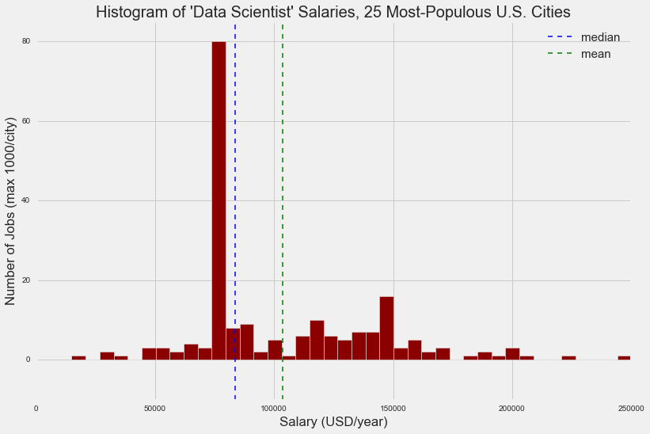
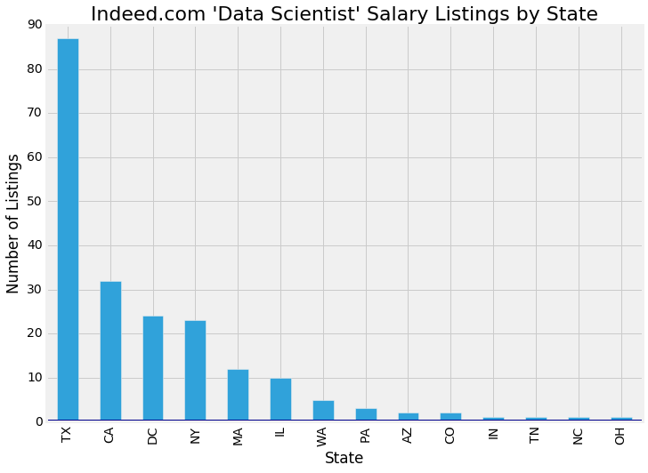
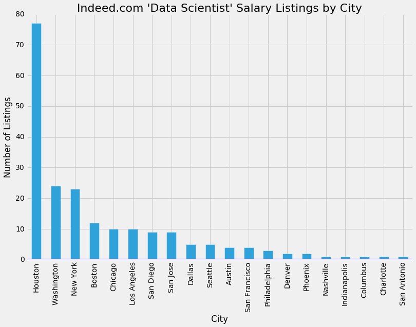
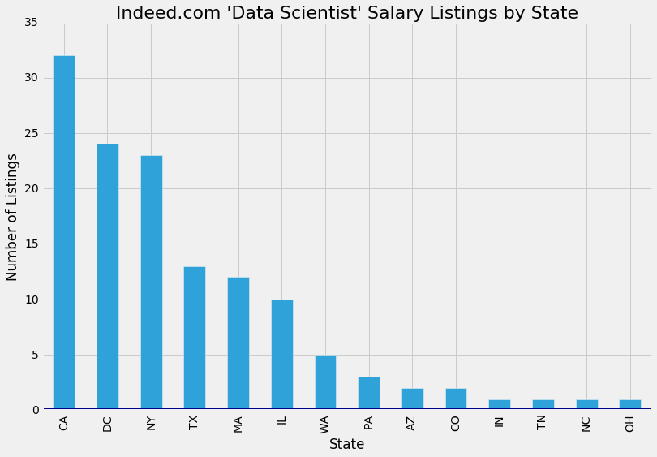
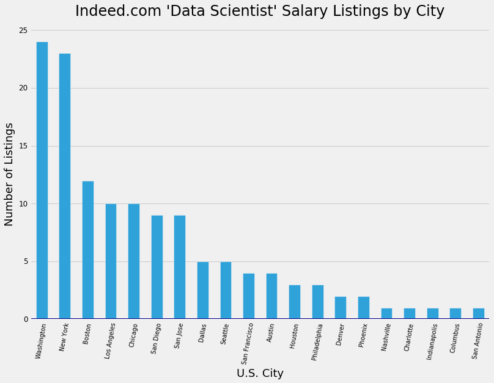
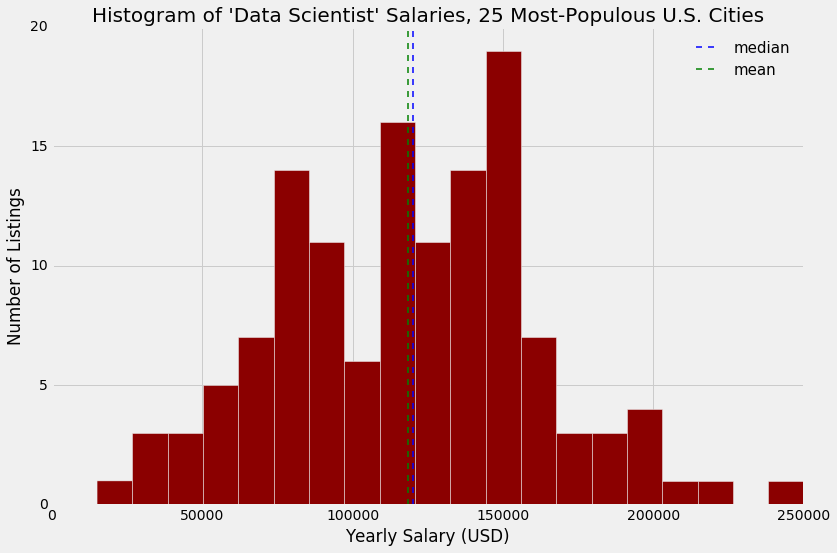
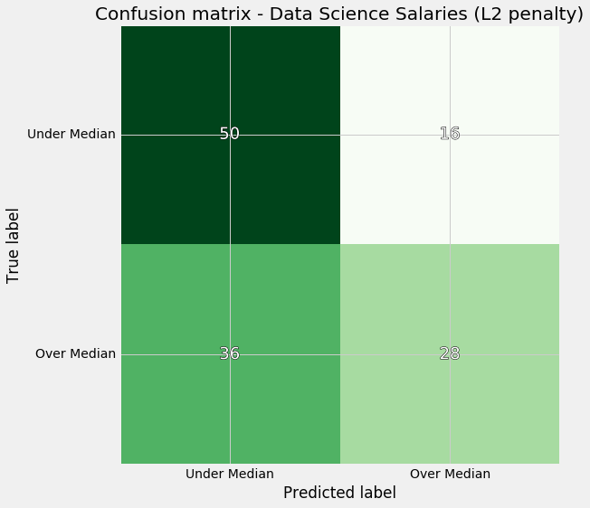
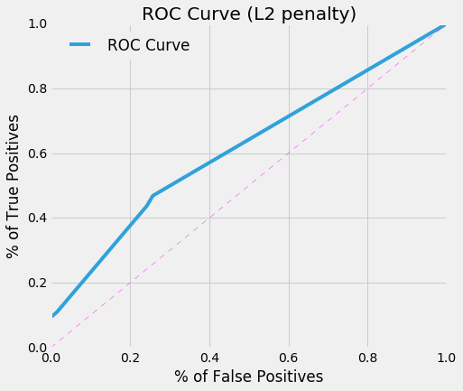

In order to make predictions about relative salary information for job listings found on Indeed.com, we have scraped that website and put together a data set to analyze and use for model-building.  We chose to request a maximum of 1,000 listings from each of the 25 most populous cities in the United States.  These cities are, by state (along with Washington, D.C.):

Arizona: Phoenix

California: Los Angeles, San Diego, San Francisco, San Jose

Colorado: Denver

Florida: Jacksonville

Illinois: Chicago

Indiana: Indianapolis

Massachusetts: Boston

Michigan: Detroit

New York: New York

North Carolina: Charlotte

Ohio: Columbus

Pennsylvania: Philadelphia

Tennessee: Memphis, Nashville

Texas: Austin, Dallas, El Paso, Fort Worth, Houston, San Antonio

Washington: Seattle

After an initial cleaning, the distribution of observations by state looked like this:

And by city, like this:

Clearly, there was someting going on in Houston!  After investigating, we realized there was a recruiting agency posting 70+ jobs at various levels, all with the same salary.  This was the only recruiting agency we explicitly removed from the data set, because obviously it was going to affect our median salary calculation.

The distribution of observations then looked like this for the remainder of analysis:

And like this, by city:

Thus, out of a potential 25,000 jobs we requested, after selecting only those with yearly salary information and sorting out the Houston problem, we ended up with 130 usable observations.  The salary distribution, which appears roughly normally-distributed, is shown in the following histogram:

To note, the median salary is $120,000 per year.

After investigating logistic regression models to predict a binary target variable ('positive' being above the median salary, and 'negative' below), we found that state income tax rate and state were not as effective at classifying as the terms 'statistical'/'statistician' and 'engineer' from job titles and whether or not the job was in San Diego.  We found that, as the sole feature in a model, the odds of a San Diego job's salary being above median over the odds of a non-San Diego job's salary being above median was roughly 8.

This is the confusion matrix using those three features in a model:

This basically shows that, while our model is better than random guessing, it is not that great.  Of all the salaries that are actually above the median, our model is classifying a lot as falling below the median (recall is under 50%).  Given that the area under the curve for random guessing on an ROC plot is 0.5, the area under our curve of nearly 0.6 means that we're only doing a little better than random guessing:

In order to improve our model, we would suggest finding a way to get more observations in the data set, such as multiplying monthly salaries to obtain usable yearly ones.  We could also expand our search by increasing number of cities and increasing number of results requested per city.  As we did with state income tax in this investigation, we could also try adding other features into the model; city population, average income, etc.
