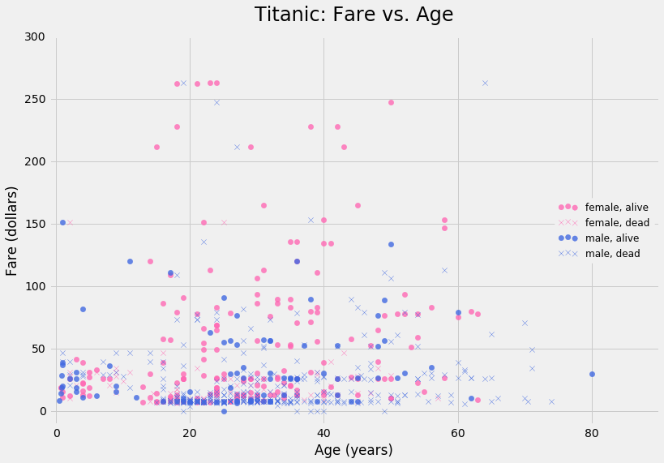
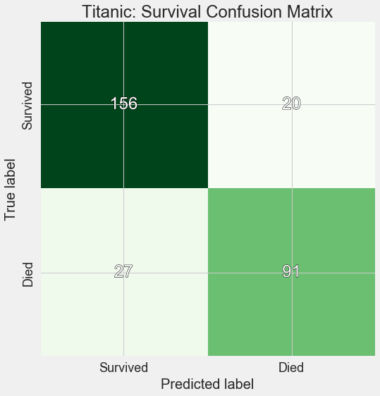

In this project, we were tasked with using the Titanic passenger data set to build a model predicting disaster survival.  For 891 observations, variables included in the original set were: survival status, passenger class, full name, sex, age, number of siblings on board, number of parents/children on board, ticket information, fare paid, cabin information, and location of embarkation.

Although about 20% of ages are missing from the data set, a histogram shows roughly a normal distribution of ages around 30 years and at least 40 children.

From the following scatterplot of fare paid vs age of passenger, we can see for example young males and well-paying females had relatively high survival rates. It appears that most males who paid no fare did not survive. No females paid no fare. There were not as many older women as older men, either alive or dead, and, in fact, almost all of them survived. The 80 year old man perhaps got helped off because he was so old. In general, it appears that the proportion of surviving females to perishing females was higher than that of surviving males to perishing males.

For our logistic regression final model including gender, class dummy variables, 'S' embarkation dummy variable as features, we obtain the following confustion matrix:

accuracy: 0.788461538462

precision: 0.741214057508

recall: 0.686390532544

area under curve: 0.769019442096

And a plot of the ROC curve itself:

