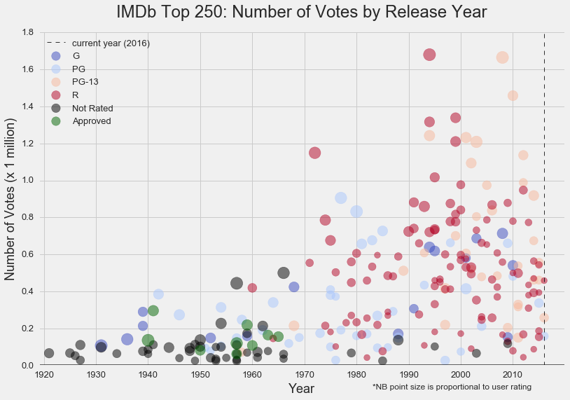
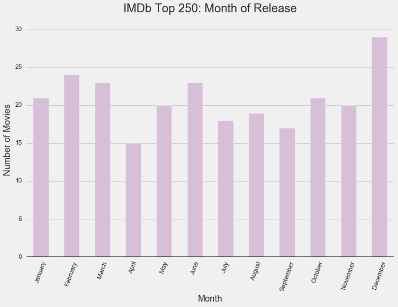
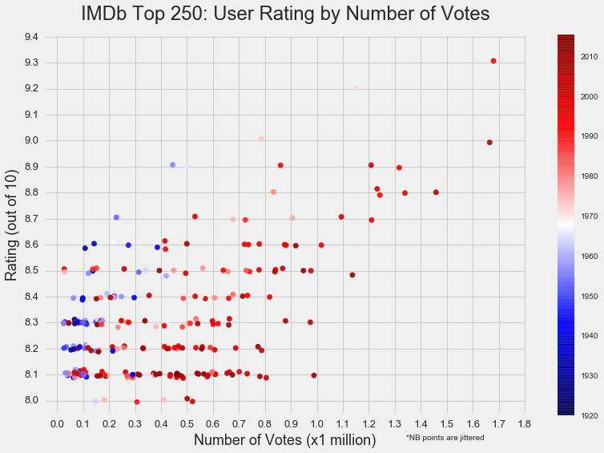
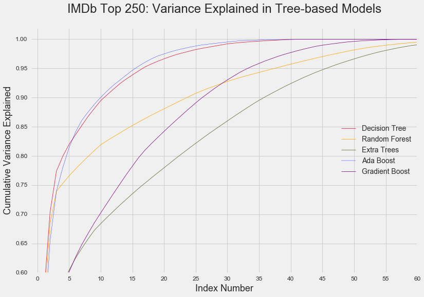

&nbsp;&nbsp;&nbsp;&nbsp;&nbsp;&nbsp;Here I examined data on the top 250 user-rated movies on IMDb.com to identify which factors are most helpful in predicting the user rating (or 'weighted rating'), which is [calculated officially](http://www.imdb.com/help/show_leaf?votestopfaq) as follows:

*weighted rating (WR) = (v ÷ (v+m)) × R + (m ÷ (v+m)) × C

Where:

R = average for the movie (mean) = (Rating)
v = number of votes for the movie = (votes)
m = minimum votes required to be listed in the Top 250
C = the mean vote across the whole report*

&nbsp;&nbsp;&nbsp;&nbsp;&nbsp;&nbsp;Data were obtained via both the [IMDBpie API](https://github.com/richardasaurus/imdb-pie) and scraping with BeautifulSoup.  

&nbsp;&nbsp;&nbsp;&nbsp;&nbsp;&nbsp;First, let's look at the distribution of number of votes for those top 250 movies:

&nbsp;&nbsp;&nbsp;&nbsp;&nbsp;&nbsp;The general shape of the histogram makes sense; we might expect the distribution of number of votes for ALL movies -- i.e., not just the top 250 -- to be normal.  Since we are only looking at the righthand slice of that, the mean of the total distribution should be on the left.  In the tail are blockbuster hits with millions of votes.

&nbsp;&nbsp;&nbsp;&nbsp;&nbsp;&nbsp;What kinds of user ratings do we see in the top 250 movies?  Relatively high, clearly!  Here are some stats with a histogram to illustrate:

mean       8.315200

min        8.000000

median     8.300000

max        9.300000

&nbsp;&nbsp;&nbsp;&nbsp;&nbsp;&nbsp;What about the distribution of release year for these top 250 movies?  Perhaps unsurprisingly -- when taking into account the present year (2016) and that the internet and IMDb came into full swing only in the past couple decades -- a large proportion of the movies in the top 250 were released relatively recently.  What size population is going to vote up a Charlie Chaplin movie in 2016?  A small one, possibly size 0!  With a bar space for each year, we can see that 1957, 1995, and 2015/16 (to date) have the most movies in the top 250 for 2016.

1957:  12 Angry Men, Paths of Glory, Witness for the Prosecution, The Bridge on the River Kwai, The Seventh Seal, Wild Strawberries, Nights of Cabiria, Throne of Blood

1995:  Se7en, The Usual Suspects, Braveheart, Toy Story, Heat, Casino, Before Sunrise, Twelve Monkeys, La Haine

&nbsp;&nbsp;&nbsp;&nbsp;&nbsp;&nbsp;The plot below displays very nicely an apparent positive correlation between number of votes and user rating of a movie in the Top 250.  Additionally, we see with the aid of color that older movies (colder/blue) tend to have fewer votes AND a lower user rating than newer movies (warmer/red):

&nbsp;&nbsp;&nbsp;&nbsp;&nbsp;&nbsp;What time of year are most movies released?  Well, of the top 250, looks like movies tended to come out in winter, summer, and around Halloween, maybe?  Low-density release months are April and September.

&nbsp;&nbsp;&nbsp;&nbsp;&nbsp;&nbsp;Now, let's plot number of votes against year of release, with color according to Motion Picture Association of America (MPAA) rating.  We can glean a lot of information from the plot below!  Looks like all 'Approved' movies came out a while ago; that dummy variable will probably not be significant in a final model for predicting user rating.  Most 'Not Rated movies' came out a while ago, as well, except for a few every once in a while over more recent years.  As we will see from the following plot, these are all foreign (non-USA).  Most high-rated movies in recent years tend to be rated 'R', with some 'PG-13'.  'PG' and 'G' also have a fair amount of real estate in the top 250 but do not get quite as many votes as 'R' and 'PG-13'.  

&nbsp;&nbsp;&nbsp;&nbsp;&nbsp;&nbsp;Here, we see that domestic films stopped getting MPAA's 'Not Rated'/'Unrated' certification a while ago, and the movies that still do get that every once in a while are all foreign.  We can also see that, while foreign films make up a fair proportion of the top 250 movies, they consistently have fewer voters than domestic movies.  This is possibly because IMDb is an American site.  As a recommendation, Netflix would do well to increase number of votes -- and thus, likely, traffic to the site -- by offering country-specific version of its site.

&nbsp;&nbsp;&nbsp;&nbsp;&nbsp;&nbsp;In terms of model building, all of our tree-based methods (decision tree, extra trees, random forest, gradient boost, ADA boost, bagged decision trees) reported that number of votes, runtime, and year of release are the top three most important features in predicting user rating.

&nbsp;&nbsp;&nbsp;&nbsp;&nbsp;&nbsp;The curves above display cumulative variance explained by the features included in the tree-based models referred to in the legend.  Decision tree performed fairly well this time but had a relatively high standard deviation.  ADA boost explained the most variance with the fewest features until the number of them reaches about thirty.  

&nbsp;&nbsp;&nbsp;&nbsp;&nbsp;&nbsp;Classifier tree-based models were used as well, performing ok but not amazingly; further work can be done integrating more features (e.g. leading actors, supporting actors, language of release, budget, opening weekend figures, etc.) to improve them.  
