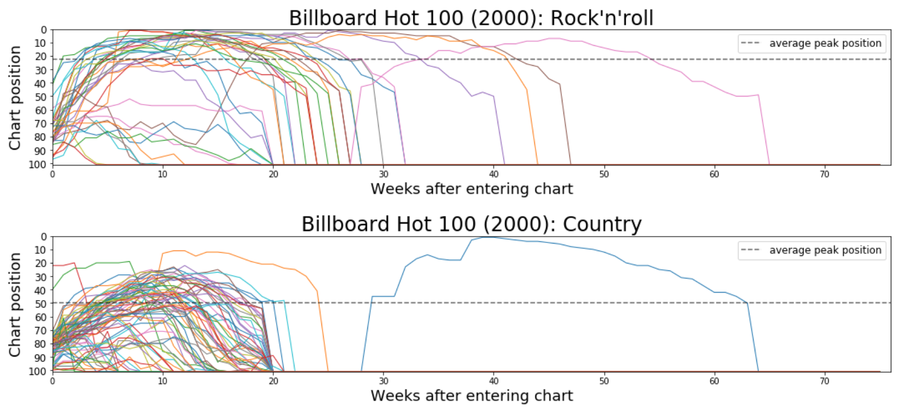

&nbsp;&nbsp;&nbsp;&nbsp;&nbsp;This early project served as an exercise in data cleaning and hypothesis testing (repo [here](https://github.com/forzavitale/BillboardHot100)).  Since the data set was provided as-is with no accompanying information, it is unclear why a bunch of the genres are mislabeled; this also led me generally not to dig much deeper into this data set.  In terms of basic exercises... string manipulation on artist names?  Check!  List comprehensions to convert track length from string to float?  Check!  Gaussian kernel density estimates to visualize smooth curve approximations of song lengths by genre?  Check!

&nbsp;&nbsp;&nbsp;&nbsp;&nbsp;I recently returned to try and extract some more interesting plots out of it, one of which is reproduced above.  Performing the t-test for independence (with unequal variance), we see that the average peak position attained by rock'n'roll tracks is significantly higher than the average peak position attained by country tracks at a 0.05 level (p = 7.8e-06).  In the plots, we see that the average for country looks like it's around 50, and rock'n'roll's looks like it's just over 20 (remember, higher number --> less optimal chart position).  Country songs look like they fall victim more frequently to the official rule that any song trending downward below 50 is kicked off the Hot 100 chart after 20 weeks.

&nbsp;&nbsp;&nbsp;&nbsp;&nbsp;Lots of interesting questions to ask here; leaving them as hypothetical for now due to questionable integrity of data set.
