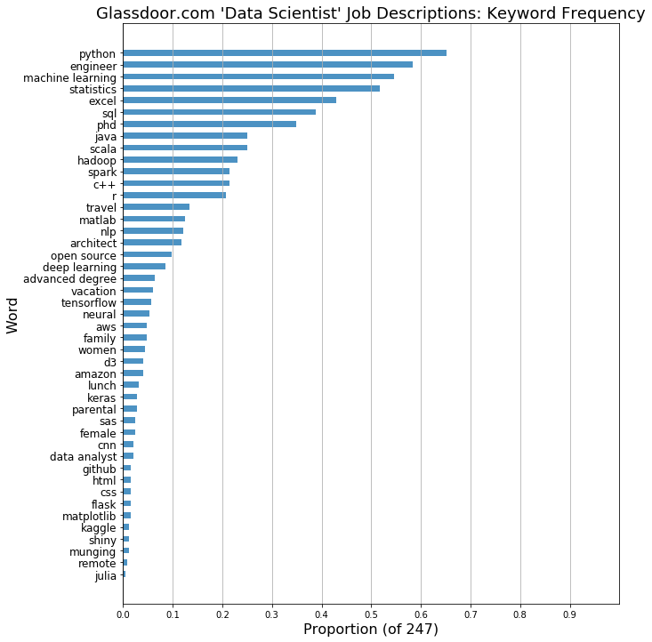

&nbsp;&nbsp;&nbsp;&nbsp;&nbsp;I was curious what the data science job market is like right now, so I wrote a bot (obviously!) to gather a bunch of relevant postings, which I then munged for my specific purposes.  The initial criteria are as follows:

* keyword "data scientist"

* full-time

* in NYC

* salary info available

* posted within past two weeks

&nbsp;&nbsp;&nbsp;&nbsp;&nbsp;The plot above is from EDA; many results came through with a keyword search of "data scientist" which were not true data scientist positions.  It is interesting to see how clustered and distinct the various roles are in terms of the minimum and maximum salaries provided to (or calculated by) Glassdoor.com.  I honed in on the "Computer and Information Research Scientist" category, requiring "Python" as a keyword and excluding "Excel" in the job description, etc.  Here is a bar chart to show the frequency of various words and phrases before the slicing on keywords just mentioned:

&nbsp;&nbsp;&nbsp;&nbsp;&nbsp;Please see the [repo](https://github.com/forzavitale/GlassdoorDS) for more.  Enjoy!
