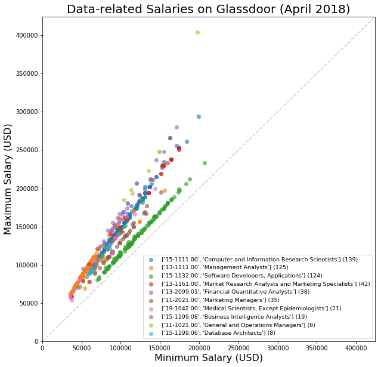

&nbsp;&nbsp;&nbsp;&nbsp;&nbsp;I've been freelancing since I left my last data science position.  Since I was curious what the market is like right now, I wrote a bot (obvi) to gather a bunch of relevant postings and then I combed through them.  The criteria were as follows:

* keyword "data scientist"

* full-time

* in NYC

* salary info available

* posted within past two weeks

&nbsp;&nbsp;&nbsp;&nbsp;&nbsp;The plot above is from EDA; many results came through with a keyword search of "data scientist" which were not true data scientist positions.  It is interesting to see how clustered and distinct the various roles are in terms of the minimum and maximum salaries provided to (or calculated by) Glassdoor.com.  Please see the jupyter notebooks for further methodology.

&nbsp;&nbsp;&nbsp;&nbsp;&nbsp;Enjoy!
