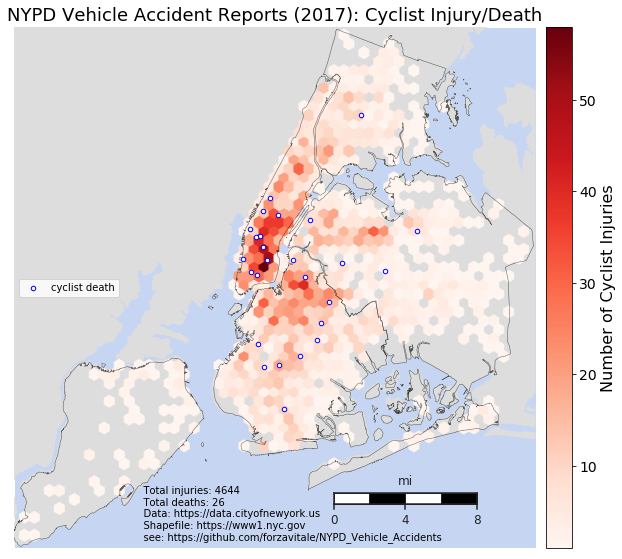
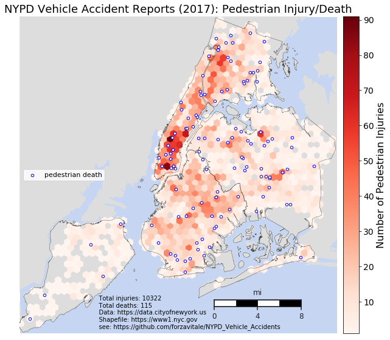
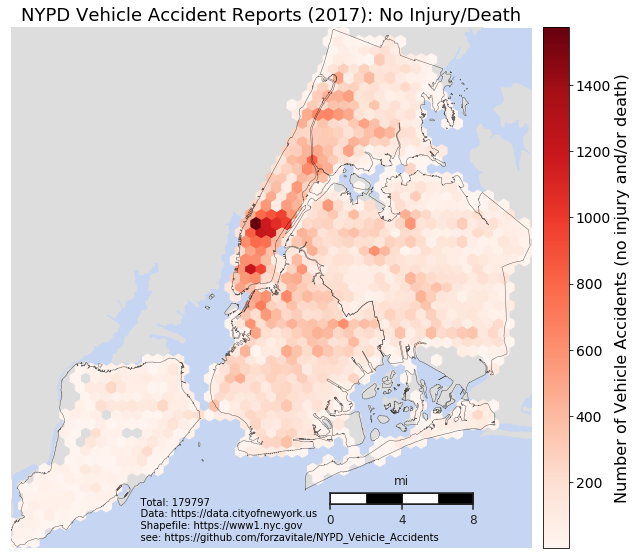

&nbsp;&nbsp;&nbsp;&nbsp;&nbsp;Since 2014, NYC Open Data has provided continually updated vehicle accident report data from the New York Police Department (NYPD), found [here](https://data.cityofnewyork.us/Public-Safety/NYPD-Motor-Vehicle-Collisions/h9gi-nx95).  

## Data set

&nbsp;&nbsp;&nbsp;&nbsp;&nbsp;Features in the original set include, but are not limited to, the following:

* time
* various geolocation info
* death/injury (total)
* death/injury (broken down by pedestrian, cyclist, motorist)
* vehicle types involved (not standardized, very messy)
* contributing factor (not standardized, not quite as messy)

&nbsp;&nbsp;&nbsp;&nbsp;&nbsp;There is no demographic information regarding any person involved, nor any fault indication/charges filed by NYPD.  

### &nbsp;&nbsp;Time
&nbsp;&nbsp;&nbsp;&nbsp;&nbsp;For the purpose of this exploration, I decided to use only the 2017 observations to get a snapshot of the most recent complete calendar year.  The time values themselves are accurate down to the minute (unknown whether approximate minute of accident or minute recorded by NYPD).

### &nbsp;&nbsp;Location
&nbsp;&nbsp;&nbsp;&nbsp;&nbsp;Some observations had null entries for latitude and/or longitude; others appeared to be outside NYC-area -- i.e., latitude outside 40.45&deg; to 40.95&deg; N and/or longitude outside 73.7&deg; to 74.3&deg; W -- so an attempt was made to use Google geocode API with street information to get appropriate coordinates.  Of about 11.5k observations missing latitude and/or longitude, approximately 90% had coordinate pairs recovered by the API.  

&nbsp;&nbsp;&nbsp;&nbsp;&nbsp;With respect to borough, I used a [shapefile provided by NYC Planning](https://www1.nyc.gov/site/planning/data-maps/open-data/districts-download-metadata.page) to fill in missing entries.  Turns out I should have used the "water areas included" version instead of the one "clipped to shoreline", since some accidents on bridges and other watery/inter-borough locations did not receive a borough assignment (see map below).  I didn't worry to much about scrapping those if necessary later on, since they only make up less than 1.5% of the total data set at the time of borough assignment (2,924 out of 222,821).

## CYCLISTS

&nbsp;&nbsp;&nbsp;&nbsp;&nbsp;First, I chose to explore the subset of 2017 observations in which at least one cyclist was injured or died.  This ended up being about 2.1% of the total number of accidents (4,668 out of 222,821).  The only ones that appear to have occurred on bridges were on the Brooklyn, Manhattan, and Williamsburg Bridges (13 in total).

&nbsp;&nbsp;&nbsp;&nbsp;&nbsp;As you can see from the plot, the highest density area for vehicle accidents involving at least one cyclist injury or death in 2017 appears to be in the East Village around Astor Place.  Deaths appear to be fairly evenly distributed by borough, with the densest occurrences by area in the bottom half of Manhattan and none on Staten Island.  This is obviously likely due to the fact that there are far more cyclists riding in lower Manhattan than anywhere else in the city.  Unfortunately, I haven't found/thought of any good proxy data for number of cyclists per unit area in NYC to normalize this plot; if you know of a source, please let me know!

## PEDESTRIANS

&nbsp;&nbsp;&nbsp;&nbsp;&nbsp;Next, I took a look at the subset of 2017 observations in which at least one pedestrian was injured or died (NB this subset is not necessarily mutually exclusive with the previous subset; i.e., a cyclist and a pedestrian could have been involved in the same accident, so that row would appear in both plots).  This time the subset is about 4.5% of the total number of accidents (10,431 out of 222,821).

&nbsp;&nbsp;&nbsp;&nbsp;&nbsp;In this plot, you can see the highest density area for vehicle accidents involving at least one pedestrian injury or death in 2017 appears also to be in Manhattan, but this time in Times Square and near the base of the Brooklyn Bridge.  This makes sense as foot traffic is higher in these touristy areas, as well as probably a higher density of tourists who are not used to walking in city traffic.  Deaths appear to be fairly evenly distributed across the city with some small clusters near denser patches of injuries in some places (east in Queens).

## MOTORISTS

&nbsp;&nbsp;&nbsp;&nbsp;&nbsp;Finally, in terms of vehicle accidents involving death and/or injury, I took a look at the subset of 2017 observations with at least one motorist injury or death.  This time the subset is about 12.5% of the total number of accidents (28,214 out of 222,821).

&nbsp;&nbsp;&nbsp;&nbsp;&nbsp;As you can see from the plot, the highest density areas for vehicle accidents involving at least one motorist injury or death in 2017 appear to be around the Queensboro Bridge, Verrazano Bridge, and around Yankee Stadium area.  

## No injury, no death

&nbsp;&nbsp;&nbsp;&nbsp;&nbsp;Lastly, I explored the density of accidents in 2017 without any injury or death involved (be it motorist, cyclist, or pedestrian).  This criterion applies to just over 80% of the total number of accidents in 2017 (179,797 out of 222,821).

&nbsp;&nbsp;&nbsp;&nbsp;&nbsp;As you can see from the plot, the highest density areas for vehicle accidents with no injury or death involved appear to be very concentrated around midtown Manhattan.  One can imagine this as a lot of fender benders due to extremely high density of pedestrians and cars (including yellow cabs unaverse to making a literal dent here and there).

&nbsp;&nbsp;&nbsp;&nbsp;&nbsp;That's it for this exploration for now, please let me know if you have any thoughts or questions!  May look into making a time lapse plot to show the accidents occurring over the course of the year.  Any thoughts on that welcome, as well.  Cheers!
